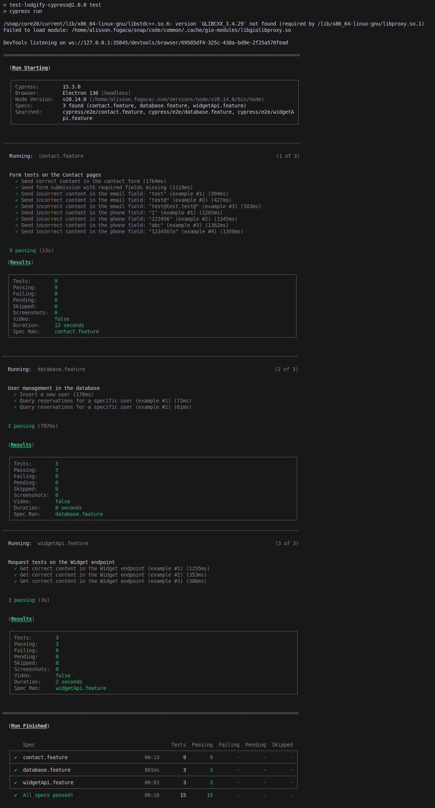
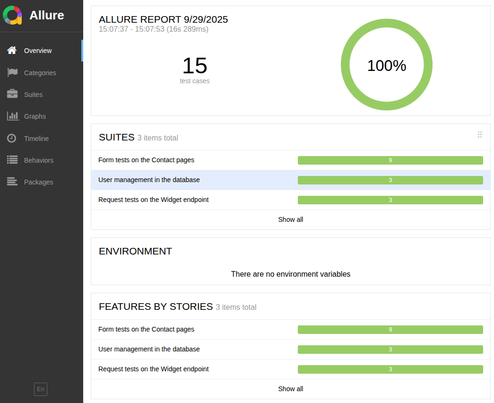
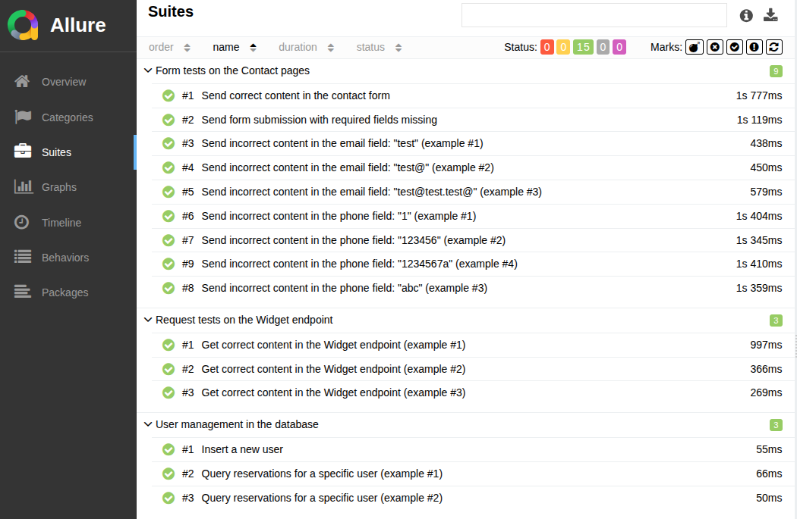

# Cypress Automation Testing - Lodgify

This repository contains automated tests developed for the **Lodgify** project using **JavaScript**, **Cypress**, and **Cucumber**.

## Overview

The automation suite is designed to validate a test contact form, covering both valid and invalid inputs, and also includes a scenario to validate the response from the Lodgify Widget endpoint. Additionally, the suite covers database-related scenarios, ensuring that user data can be correctly inserted and queried in the system. Currently, the test suite includes 15 automated test cases, with a scalable structure for future expansion.

**Note**: Ideally, I would like to run the scenarios using the real contact form on the Lodgify website, but due to anti-bot protections such as Cloudflare, this became unfeasible. For this reason, the form automation uses a test contact form, while the endpoint validation still targets Lodgify’s Widget API.

## Requirements

You must have Node.js installed on your machine You can download it here: [https://nodejs.org](https://nodejs.org)

#### Dependencies

The project in JavaScript uses some NPM dependencies already configured (you only need to do run the npm install command), as follows:

- [Cypress](https://www.npmjs.com/package/cypress)
- [@badeball/cypress-cucumber-preprocessor](https://www.npmjs.com/package/@badeball/cypress-cucumber-preprocessor)
- [@bahmutov/cypress-esbuild-preprocessor](https://www.npmjs.com/package/@bahmutov/cypress-esbuild-preprocessor)
- [Path](https://www.npmjs.com/package/path)
- [@shelex/cypress-allure-plugin](https://www.npmjs.com/package/@shelex/cypress-allure-plugin)
- [allure-commandline](https://www.npmjs.com/package/allure-commandline)
- [better-sqlite3](https://www.npmjs.com/package/better-sqlite3)

After cloning the repository, install the required dependencies by running:

```bash
npm install
```

## Running the Tests

To start the test runner in headless execution:

```bash
npm test
```

Alternatively, for in interactive mode:

```bash
npm run test:headless
```

## Generating Allure Report

After running the tests, you can generate a detailed Allure Report to visualize the test execution results.

To generate the report, run:

```bash
npm run allure:generate
```

To open the generated report in your browser (if supported by your system):

```bash
npm run allure:open
```

The report will contain an overview of all executed scenarios, status (passed/failed), steps, and more.

## Continuous Integration (CI/CD)

For automated execution in a continuous integration environment, this project is configured with GitHub Actions. The pipeline will automatically run all tests on specific events, ensuring code quality and functionality.

To view the results of the automated pipeline, navigate to the "Actions" tab in the GitHub repository.

Additionally, the Allure test report is published and accessible at:

- [https://fogaca.net/test-lodgify-cypress/](https://fogaca.net/test-lodgify-cypress/)

## Test Coverage

The following test scenarios are included:

- Submit contact form with valid data;
- Submit contact form with required fields missing;
- Submit contact form with multiple invalid email formats;
- Submit contact form with multiple invalid phone formats;
- Validate GET request to the `widget` endpoint.

You can find all test cases in:

```
cypress/e2e/
```

## Example - Automation in Action



## Example - Allure Report

 
